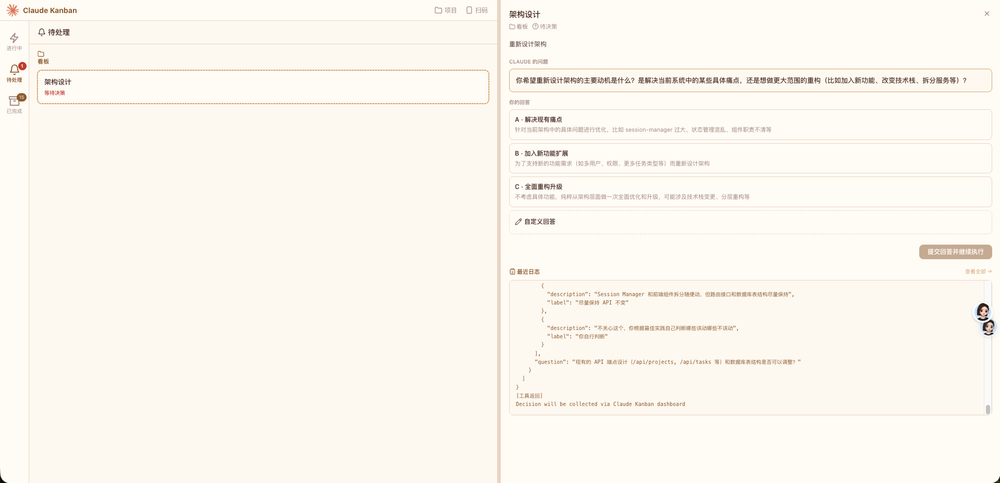

# Claude Kanban

<p align="center">
  
</p>

<p align="center">
  <strong>🚀 一个命令启动你的 AI 任务看板，让多个 Claude Code 会话自动协作。</strong>
</p>

<p align="center">
  <a href="#快速开始">快速开始</a> ·
  <a href="#核心特性">核心特性</a> ·
  <a href="#工作原理">工作原理</a> ·
  <a href="#命令行">命令行</a> ·
  <a href="#开发">开发</a>
</p>

---

## 这是什么？

**Claude Kanban** 是一个基于 Claude Code 的多任务看板管理系统。

你只需要在终端输入 `ck`，它会启动一个本地 Web 看板。在看板上创建任务，Claude 就会自动开始工作 —— 多个任务可以并发执行，遇到需要你决策的问题会暂停等待，完成后提交结果等你验收。

就像一个 **AI 任务工厂**：你把任务丢进看板，Claude 自动领取、执行、汇报，你只需要做关键决策和最终把关。

## 快速开始

```bash
# 需要 Node.js >= 18，且已安装 Claude Code CLI
git clone https://github.com/overcast404/claude-kanban.git
cd claude-kanban
npm install && npm run build && npm install -g .
ck
```

浏览器会自动打开 `http://localhost:14567`，你就可以创建第一个项目并添加任务了。

> **前提条件**：本机需要安装 [Claude Code](https://docs.anthropic.com/en/docs/claude-code/overview) CLI。

## 核心特性

- **📋 看板式任务管理** — 创建项目、添加任务，任务按状态分列展示，一目了然
- **🤖 自动任务执行** — Claude CLI 作为工作进程，自动领取 pending 任务并开始编码
- **⚡ 多任务并发** — 每个任务独立运行 Claude 会话，无并发上限
- **💬 智能决策介入** — Claude 遇到不确定的问题时会暂停提问，你通过 UI 选择或输入答案后继续
- **✅ 结果验收** — Claude 完成任务后提交摘要，你审核通过后任务进入 done
- **🔄 异常自动恢复** — Claude 进程异常退出时系统自动恢复会话，提示 Claude 明确下一步意图
- **📱 移动端适配** — 响应式布局 + 底部导航，手机上也能管理任务
- **📡 实时通信** — WebSocket 推送任务状态变化，无需刷新页面
- **📷 局域网扫码** — 自动检测局域网 IP，生成二维码供手机扫码访问
- **💾 轻量存储** — SQLite (WAL 模式)，零配置，数据存放在 `~/.claude-kanban/`

## 任务生命周期

```
pending → running → deciding → running → reviewing → done
```

| 状态 | 图标 | 说明 |
|---|---|---|
| `pending` | 📥 | 已创建，等待 Claude 领取执行 |
| `running` | ⚡ | Claude 正在工作中，可实时看到输出日志 |
| `deciding` | ❓ | Claude 提出问题，等待你在 UI 中做出决策 |
| `reviewing` | ✅ | Claude 提交了成果，等待你验收 |
| `done` | 📦 | 你已验收通过，任务归档 |

## 工作原理

### 会话编排

系统为每个任务 spawn 一个 Claude CLI 子进程，无并发上限。每个子进程会收到：

- **钩子配置**（`hooks/<taskId>.json`）— 拦截 Claude 的关键行为
- **协议约束**（`<taskId>-protocol.md`）— 告诉 Claude 何时必须提问、何时提交结果
- **MCP 连接**（`<taskId>-mcp.json`）— 提供 `mark_complete` 工具供 Claude 调用

### 钩子拦截

| 事件 | 行为 |
|---|---|
| `AskUserQuestion` | 阻止 Claude 直接提问，转为 Decision 记录，由你在 UI 中回答 |
| `mark_complete` | 允许调用，任务自动进入 reviewing 状态 |
| `PermissionRequest` | 自动批准（读写文件、执行命令等操作） |

### 强制修正

如果 Claude 进程在未发出任何信号的情况下退出（如崩溃、OOM），系统会立即重启会话，并通过协议文本提示 Claude："你上次没有明确结束就退出了，请使用 AskUserQuestion 或 mark_complete 表明你的意图"。

## 命令行

```bash
ck                     # 默认端口 14567，自动打开浏览器
ck --port 8080         # 自定义端口
ck --data-dir ~/data   # 自定义数据目录（默认 ~/.claude-kanban/）
ck --no-open           # 不自动打开浏览器
ck --dev               # 开发模式（数据存储在 dev-data/）
ck --version           # 查看版本
```

## 开发

```bash
npm run dev     # 启动开发服务器
                # Server: tsx watch → :14567
                # Client: Vite HMR → :14568（自动代理 /api 和 /ws）

npm run build   # 构建：tsc 编译 src/ → dist/，vite 打包 client/ → dist/public/
```

### 技术栈

| 层 | 技术 |
|---|---|
| 后端 | Express · WebSocket (ws) · better-sqlite3 (WAL) |
| 前端 | React 18 · Vite 5 · Tailwind CSS 4 |
| CLI | Node.js，全局命令 `ck` |

### 项目结构

```
src/                  # 服务端
├── cli.ts            # CLI 入口（bin: ck）
├── index.ts          # Express 应用 + WebSocket
├── db.ts             # SQLite 数据库
├── types.ts          # 共享类型
├── broadcast.ts      # WebSocket 广播
├── routes/           # API 路由（projects, tasks, hooks, mcp）
└── services/         # Claude CLI 会话编排
client/               # React 前端
└── src/components/   # UI 组件（看板、任务卡片、详情面板等）
```

## 贡献

欢迎提 Issue 和 PR。项目处于早期阶段，任何想法都有机会变成核心功能。

## License

MIT
